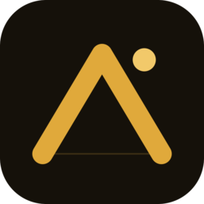

<div align="center">



# Edge

**Have an edge.** — MTS엔 없는, 나만의 투자 판단 우위를 만드는 보조 도구.

iOS · Android · Kotlin Multiplatform · Ktor 백엔드

</div>

---

## 개요

**Edge**는 개인용 주식 분석 보조 앱입니다. MTS(증권사 앱)가 *매매 실행* 도구라면, Edge는 그 앞단의 *판단 보조* 도구예요. 시세·수급·공시·뉴스·재무를 한데 모아 **내 포지션 기준으로** 해석하고, AI가 종합 코멘트를 붙입니다.

혼자 쓰려고 시작했고, 지금은 지인 몇 명에게 iOS·Android 앱으로 배포해 함께 쓰고 있습니다.

> 설계 철학: **사실은 계산으로, 해석만 AI에게.** 목표가·수급·밸류에이션 같은 수치는 백엔드가 실제 데이터로 계산하고, Claude는 그 위에서 "어떻게 봐야 하나"만 풀어줍니다(환각 방지).

---

## 주요 기능

- **종목 상세 분석** — 시세·차트, 외인/기관 수급, 기술적 지표(이평선·RSI·거래량), PER/PBR과 **역사적 밸류에이션 밴드**(지금이 비싼지 싼지), 동종 peer 상대 밸류, 신호 백테스트(이 종목은 기관이 살 때 잘 오르나), 공매도·실적·공시까지 한 화면에.
- **AI 종합 코멘트** — 위 사실들을 내 평단·목표가 기준으로 해석. 공격/방어 모드 선택, 가격이 움직이면 자동 재생성.
- **뉴스·공시 영향 판정** — 새 뉴스·DART 공시가 이 종목에 **호재/악재인지·강도·선반영 여부**를 미리 가늠.
- **데일리 브리핑** — 장 시작 전 "오늘 뭐 봐야 해?"를 한 화면에. 코스피 방향 선행신호(미국 종가·야간 선물), 시장 분위기, 내 종목 영향, 섹터 동향, 거시 이벤트 캘린더(CPI·FOMC 등).
- **내 자산** — 보유 종목 손익, 섹터 비중·집중도 경고, 손익 기여도.
- **내 패턴** — 매매일지(왜 샀나 사유 태그) 기반 승률·손절/익절 규율·놓친 종목 통계, AI 시장 방향 적중률 추적.
- **Slack 연동** — 운영 오류·아침 브리핑·신호 알림·AI 코멘트 아카이브·이벤트 리마인더·비용 모니터링 + `/edge 종목명` 슬래시 명령.

---

## 아키텍처

앱에는 **API 키를 두지 않습니다.** 모든 외부 호출(한국투자증권/DART/네이버/Claude)을 백엔드가 대행해요.

```
[iOS · Android 앱]   KMP 공유 로직 · API 키 없음
        │  HTTPS (X-Edge-Token 인증)
        ▼
[Ktor 백엔드 · Cloud Run]   한투키 1개 · Claude키 · DART키 보관
   ├ 시세 프록시 + 공유 캐시        N명 → ≈1× 비용 / Rate Limit
   ├ 수급·공시 배치 (장후 확정값)
   ├ Claude 호출 + 결과 공유 캐시   같은 종목·시점 분석 1회만 생성
   └ Cloud Scheduler 잡            아침 브리핑·신호 스캔·이벤트 동기화
        │
   [한투 Open API · DART · 네이버 검색 · Claude API]
```

이렇게 두면 ① 친구는 한투 계좌 없이 앱만 설치하면 되고 ② 키가 클라이언트에 노출되지 않으며 ③ 시세·분석을 공유 캐시로 묶어 비용을 1배 수준으로 누릅니다.

---

## 기술 스택

| 영역 | 선택 |
|---|---|
| 언어 | Kotlin (Multiplatform) |
| iOS UI | SwiftUI |
| Android UI | Jetpack Compose |
| 로컬 DB | SQLDelight |
| 백엔드 | Ktor (Kotlin) on Cloud Run |
| AI | Claude API (Sonnet 4.6 / 필요시 Opus) |
| 데이터 | 한국투자증권 Open API · DART · 네이버 검색 API · Yahoo Finance(매크로) |
| 인프라 | Cloud Run · Cloud Scheduler · Cloud Tasks · Secret Manager · GCS |

---

## 프로젝트 구조

```
edge/
├── app/                  Kotlin Multiplatform 앱
│   ├── iosApp/           SwiftUI (iOS)
│   ├── androidApp/       Jetpack Compose (Android)
│   ├── sharedLogic/      공유 비즈니스 로직 · API 클라이언트 · 모델
│   └── sharedUI/         공유 UI 유틸
├── backend/              Ktor 백엔드 (시세 프록시 · 분석 · 캐시 · 스케줄러)
│   └── src/main/kotlin/com/haky/edge/   routes · ai · kis · dart · macro · news · slack …
├── docs/                 의사결정 · 개발로그 · 백엔드 API/아키텍처 문서
└── CLAUDE.md             제품 컨텍스트 · Phase 체크리스트(살아있는 계획의 단일 출처)
```

---

## 실행

**백엔드** (`.env`에 한투·DART·네이버·Claude 키 필요)
```bash
cd backend && ./run.sh        # http://localhost:8080
```

**Android**
```bash
cd app && ./gradlew :androidApp:assembleDebug
```

**iOS** — `app/iosApp`를 Xcode로 열어 실행. (`Secrets.xcconfig`에 백엔드 URL·토큰 주입)

자세한 빌드/배포는 [`docs/backend/development.md`](docs/backend/development.md), API는 [`docs/backend/api.md`](docs/backend/api.md) 참고.

---

## 문서

| 문서 | 무엇 |
|---|---|
| [CLAUDE.md](CLAUDE.md) | 제품 컨텍스트 · Phase별 기능 체크리스트 |
| [docs/decisions.md](docs/decisions.md) | 주요 의사결정과 이유 (ADR-lite) |
| [docs/devlog.md](docs/devlog.md) | 세션별 작업 로그 |
| [docs/backend/architecture.md](docs/backend/architecture.md) | 백엔드 패키지 구조 |
| [docs/backend/api.md](docs/backend/api.md) | 백엔드 API 레퍼런스 |
| [docs/backend/kis-api-notes.md](docs/backend/kis-api-notes.md) | 한투(KIS) API 함정 모음 |

---

## 상태

iOS·Android 풀 패리티 완성, 백엔드 Cloud Run 배포 중, 지인 배포 운영 중. 핵심 기능은 마무리 단계예요.

> ⚠️ 개인 학습·참고용 프로젝트입니다. 표시되는 분석·AI 코멘트는 **투자 권유가 아니며**, 모든 투자 판단과 책임은 본인에게 있습니다.
